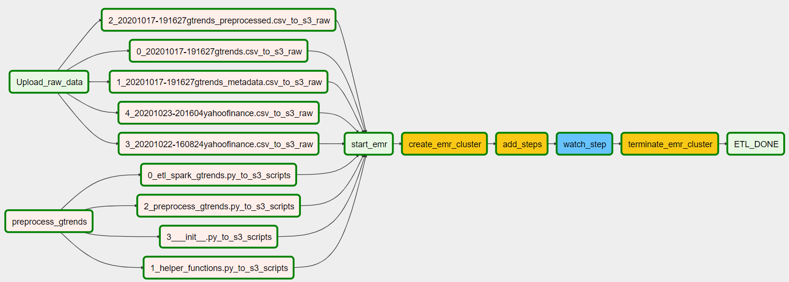
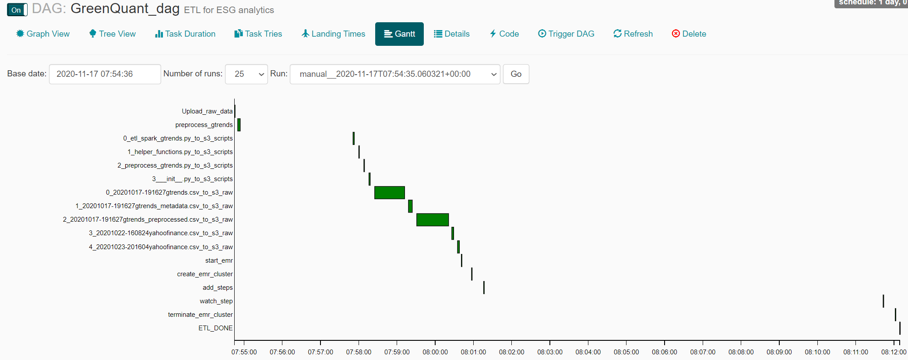
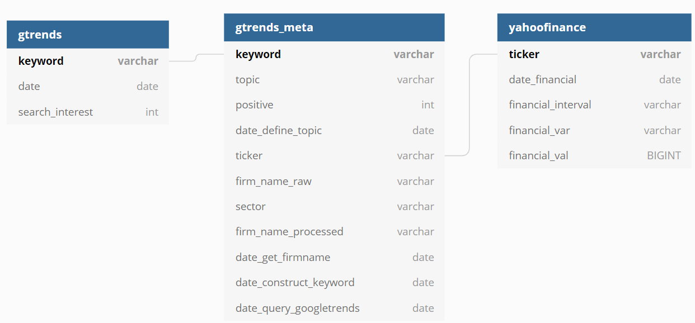

# Alternative indicators for firms' sustainability and ESG ratings
#### *Capstone project for the data engineer nanodegree at Udacity*

The project centers around a fictitious firm called Green Quant that provides data about a firm's sustainability profile. It combines both worlds from alternative indicators such as historical search interest from Google Trends and classical financial metrics taken from Yahoo! Finance. This showcases my skills in applying a broad range of tools like Apache Airflow, AWS EMR and Apache Spark.

## Problem: Measure firm sustainability

The global economy faces the unprecedented challenge of climate change and need to aim for at least zero emission. The finance industry plays a central role as an intermediary to boost these developments by directing investment flows towards sustainable firms, innovative solutions and green tech. 

But, how can you distinguish between sustainable firms and non-sustainable ones? Analysts and rating agencies evaluate a firm’s sustainability based on a framework that covers environmental, social and governmental criteria (ESG). Those criteria differ largely from one ranking to another, with varying and sometimes non-transparent methodology. With an increasing focus on sustainability, managers and stakeholders need to know how the public and market perceive their sustainability and those of competitors. Beyond ratings, rankings and reports, alternative and publicly available indicators could shed light on ESG performance and inform managers about potential challenges. 

## Solution: Alternative insights on ESG performance with Google Trends

My company offers insights on perceived ESG performance of firms with alternative indicators, such as search interest on ESG topics from Google Trends. Therefore, the aim is to build a dataset that includes information on perceived ESG performance of firms listed in S&P 500 through Google Trends. Additionally, more traditional financial indicators complement the dataset. Thereby, Green Quant delivers the best of hard facts and sustainable factors. 

In this project, I apply what I have learned about data lakes, Apache Spark and Apache Airflow to build an ELT pipeline for a data lake hosted on AWS S3. It enables stakeholders to assess a company's ESG profile alongside key financial indicators. The data flow starts on a local machine retrieving historical search interest on ESG topics of a firm through the Google Trends API. Beyond this, they obtain multiple financial indicators from a Yahoo! Finance API. After preprocessing the raw API output, an Airflow DAG takes over to orchestrate tasks that push data to S3, launch an EMR Spark cluster and process it with PySpark. Eventually, processed data flows back to S3 and becomes accessible for data analysis, for example through AWS Quicksight, AWS Athena or other solutions that translates data to actionable advice. 

To summarize, the ETL pipeline starts by constructing input data for API queries (Google Trends, Yahoo! Finance). It comprises the largest firms within the US that are part of the S&P 500 index. After retrieving historical search interest from Google Trends and financial data from Yahoo! Finance, Airflow takes over to manage the pipeline. It triggers tasks that upload the data to S3, launch an EMR Spark cluster on which a Spark job preprocesses and validates the data. Finally, an analyst can explore the data for actionable insights. 

## Data lakes on AWS with Spark and Airflow 

We opt for a data lake to have maximum flexibility to later possibly revise data collection. While deciding on data architecture it is unclear which data best reflects ESG performance. The data lake architecture allows to develop different dimensions of sustainability indicators without committing to a fixed structure like in a relational database. 

The data pipeline proceeds as follows: Local machines retrieve data from the web and upload it to S3. Spark processes this raw data and metadata which reside in S3 in csv format. Thereafter, it feeds back to S3, such that an analytics team can easily access it for finding insights. AWS Quicksight could accomplish the last step for fast data analytics.

### Why data lake

Our fictive company sells alternative indicators on ESG performance to firms and decision makers. The indicators, their properties and data types likely change in the future. Regulators constantly revise their ESG frameworks to follow developments within the new field of sustainable taxation. For example it could be beneficial to screen news articles for ESG information, since the media or an NGO uncovers ESG issues investigatively. A business would rarely admit that it has violated human rights or spilled waste water on purpose. Thus, ESG information comes in various, yet unknown formats. Instead of strong commitments to data types and database structures, we aim for full flexibility.

This is a strong case for data lakes, where all data types of source data are welcomed. Data lakes are open to all formats, values and types. We can store unstructured, semi-structured, structured, text, images, json or csv, high or low value datasets. Additionally, data size could become large, which requires efficient retrieval methods like ELT with Spark Clusters. Initially data stores in raw formats, then loads into a Spark cluster, and lastly transforms for data output. This approach ensures massive parallelism and scalability with the big data processing tools Spark and HDFS. 

|              | **Data Lake Properties**		  |
|:------------:|-------------------------------------------------------------|
|   Data form  |                         All formats                         |
|  Data value  |              High, medium and to-be-discovered              |
|   Ingestion  |                             ELT                             |
|  Data model  | Star, snowflake, OLAP, other ad-hoc representation possible |
|    Schema    |                        schema-on-read                       |
|  Technology  |             Commodity hardware with parallelism             |
| Data quality |          Mixed (raw, preprocessed, higher quality)          |
|     Users    |      Data scientists, business analytics, ML engineers      |
|   Analytics  |     Machine learning, graph analytics, data exploration     

Data lakes also face challenges in three ways. Firstly, data might become unmanageable when it resembles a chaotic data garbage dump not having any structure to rely on. Therefore, data engineers need to reduce that risk by including extensive metadata from which the collection and storage process becomes transparent. Secondly, multiple departments access the data at once which makes data governance and access management challenging. Thirdly, other solutions could coexist alongside a data lake like a data warehouse, data marts or even relational databases. Therefore, data architects have to assign clear responsibilities and associated tasks of a data infrastructure. When the business unit for example needs dimensional data modelling, the architecture should provide room for modularity.  

### AWS options to implement data lakes

We consider the following options to implement a data lake on AWS:

|  Option | Storage | Processing | AWS-managed solution   | vendor-managed              |
|---|---------|------------|------------------------|-----------------------------|
| 1. | HDFS    | Spark      | AWS EMR (HDFS + Spark) | EC2, vendor solution        |
| 2. | S3      | Spark      | AWS EMR (Spark only)   | EC2, vendor solution        |
| 3. | S3      | Serverless | AWS Athena             | Serverless, vendor solution |

The schema below provide an overview of technical components  and AWS solutions. 

**Option 1**: AWS EMR with HDFS and Spark

**Option 2**: AWS EMR with S3 and Spark 

**Option 3**: AWS 

We opt for **Option 2** since it combines the simplicity of S3 as a storage platform with the big data processing power of Spark EMR cluster. Moreover, I benefit from the learning experience when implementing a Spark ETL job on EMR clusters. 

### Data pipelines with Airflow

Airflow defines, schedules, executes and monitors workflows using directed acyclic graphs (DAG). A DAG is a sequence of tasks, organized to reflect their relationships and dependencies. 
There are several reasons to use Airflow:

* custom operators and plugins which help templatize the DAGs, facilitating to create/deploy new DAGs
* More control over customizable jobs tailored for specific needs, as compared to Nifi/Pentaho with their drag and drop interface
* easy to manage data migration and orchestration of other cron jobs
* used for advanced data use cases such as deploying ML models
* tech companies which rely on efficient data flows rely on it, such as AirBnb, Slack and Robinhood
* Service level agreements (SLA) can be defined at job level with E-Mail notifications when a miss occurs
* Easy to backfill the data if jobs fail
* accessible through both command line and a beautiful GUI

## Data: Search interest and financial metrics

### Sourcing & collection 

The data generally comprises two parts, where one serves as input to an API query and the other is what the API returns. The input data builds on firm names and defined topics of ESG criteria. The scripts in `./src/data/0*.py` pull the current list of S&P 500 firm names (`0get_firm_names.py`), outline ESG criteria (`0define_esg_topic.py`) and construct keywords by joining firm names and ESG topics (`0construct_keywords.py`). Those constructed keywords feed into the Google Trends or Yahoo! Finance API which return query results. Those returned output makes up the main data of either search interest over the last five years for a given keyword or all sorts of financial indicators about a firm.

**API input**: Prepare and load query arguments for Google Trends and Yahoo! Finance. Arguments are firm trading tickers without legal suffix or prefix as found in the [S&P 500 index](https://en.wikipedia.org/wiki/S%26P_500_Index) for the financial data or a combination of firm name and ESG criteria. For example, the firm '3M' has the ticker *MMM* and *scandal 3M* as an ESG-related keyword for which weekly search interest is obtained for the last five years. Querying Yahoo! with *MMM* returns the latest disclosed financial data, such as total revenue, total debt or gross profit. 

**Steps to obtain data**

To summarize, the data collection proceeds in the following steps: 

1. Get list of firm names currently listed in S&P 500 and preprocess to exclude legal suffix and equity groupings  (`0get_firm_names.py`)
3. Define ESG criteria and store them as CSV (`0define_esg_topics.py`)
4. Combine firm names and ESG criteria to construct keywords for Google Trends (`0construct_keywords.py`)
5. Run the API queries (`query_google_trends.py`, `query_yahoofinance.py`)
6. Conduct preprocessing of Google Trends data with `preprocess_gtrends.py`
7. Process financial data by executing `process_yahoofinance.py`. This creates the file `./data/processed/yahoofinance_long.csv` and makes financial data accessible. 

*Note:* Steps for data collection could already be scheduled with tasks through Airflow. To stay concise, the pipeline with Airflow assumes that the above steps are successfully completed.

### Data processing and description

Description of relevant dataset which are uploaded to the S3 'esg-analytics' bucket with prefix `'raw'`:

| dataset | Rows | Columns | Column names | Description |
| --- |--- | --- | ---| ---|
| 20201017-191627gtrends_preprocessed.csv | 998325 | 3 | date, keyword, search_interest| |
|20201017-191627gtrends_metadata.csv |3835 |11|topic, \[...\] date_query_googletrends | |
|20201023-201604yahoofinance.csv|232|242|symbol, \[...\] WriteOff |
|**Total**|**1002392**|**256**|| |

Financial data gets processed solely scripts running locally, whereas search interest data relies both on local preprocessing and a Spark job on EMR. The following gives an overview of *local* data processing.

**Local data processing**

Execute the following scripts to process data on the *local* machine *before* starting Airflow: 

1. `2preprocess_gtrends.py`
2. `3process_yahoofinance.py`

The number prefix from indicates what stages the data is in. `0[...]` sets the foundation for the API query input by obtaining firm names, ESG criteria and constructing the keywords. `1[...]` runs API queries, whereas `2[...]` preprocesses and `3[...]` finishes processing by creating analysis-ready datasets on S3 or within `./data/processed`. 

## Airflow DAG

I implemented a DAG (`./src/airflow/dags/esg_dag.py`) that uploads raw data and a PySpark script to S3, launches an EMR cluster and runs a Spark step which calls the PySpark script as a Spark step. Lastly, the processed data loads back to S3, where it can be accessed for further analysis.

DAG Graph view of the tasks and dependencies:

Running the DAG takes around 17 minutes in total as indicated by the Gantt chart. 

### Entity relationship diagram (ERD)

The whole ETL results in the following relationship:

**Putting it all together into one dataset for analysis** 

To merge all data to a single analysis dataset, requires some aggregations since we want one row for each firm. First, *gtrends* needs to be collapsed on the keyword level by taking the average, maximum or median search interest to remove the time dimension. Next, merge *gtrends* with *gtrends_meta* and reshape the dataframe to a wide format with one firm for each row. Second, *yahoofinance* needs to be reshaped into wide format to also get one row for each firm. Lastly, every 

*Note:* I only outline this roadmap towards data analysis in favor of focusing on Airflow and Spark. 

## Discussion

### Update frequency

Different sources with different updating schedules require a distinct update schedule. Google Trends data becomes available on a daily basis, whereas firms disclose financial data annually. A rule of thumb states that the data should be updated in a reasonable short interval of the source with the shortest update intervals which is each day Google Trends. However, due to server rate limits and forced timeouts, a query for all firm name-ESG topic combinations takes around 20 hours ($\frac{32500 \text{ keywords }}{5 \text{ batch size }} \times 24\text{s timeout }=43.33 \text{ hours}$). Therefore, it makes sense to run the Google Trends and Yahoo! Finance query each week. 

### Scenarios

**What if the data was increased by 100x?**

S3 limits range from 5 terabyte as a whole to 5GB per single object. If object size becomes greater than 5GB, you can simply split it and do a multi-part upload. 

**What if  the pipelines were run on a daily basis by 7am?**

With collected data at its place, it would be no problem to run the ETL and Spark job in the morning. However, the data updates only weekly, as discussed under subsection *Update frequency*. Thus, it would not be sensible to launch an EMR cluster just by a fix schedule. In contrast to this, a viable approach would be to create a script that checks, whether raw data has been updated on S3 and triggers the subsequent ETL. Launching the cluster and executing Spark steps takes around 12 minutes, as shown here:

** What if the database needed to be accessed by 100+ people?**

Since the data resides in an S3 bucket, an connection to another would be necessary either way to obtain insights from the data. One solution would rely on AWS Athena to query S3 buckets for data insights. Another would be to transfer data from S3 to AWS Redshift or Aurora to have another suitable database infrastructure when queries become more frequent. 

### Possible extensions or improvements

To keep it simple, I refrain from optimizing or refactoring the code further. Instead, I list points that could be improved in future releases of the project either because they resemble industry’s best practices or have other advantages like lower runtime. 

**Collected data**

* Automate the whole process from engineering keywords, querying APIs and exploring the data with Airflow. For example, all Python scripts in `./src/data/` called `0*.py` construct the input for the API queries ran by `query_*.py`. So, tasks or even a subDAG could be added to the existing DAG which starts already with the data present.  

* Airflow has the advantage to monitor longer processes, such as data collection. A weekly job could trigger a script that retrieves current data from Google Trends and Yahoo!Finance API. In case of failure, for example due to connection problems, the DAG makes it transparent and triggers a retry after a certain timeout or based on an event, such as detecting internet connection again. 

* Make API queries atomic by querying only a small chunk each time. For example, a query  may add one entry for each firm, which gives both fast execution of the task and makes it resilient against failures such as connection issues. 

**DAG**

* Use the `params` arguments within the `EmrAddStepsOperator()` to submit local settings to the `SPARK_STEPS`. 

**AWS EMR**
* Ensure to load the correct Google Trends dataset and pass filenames to "Args" in SPARK_STEPS to load the most recent files

